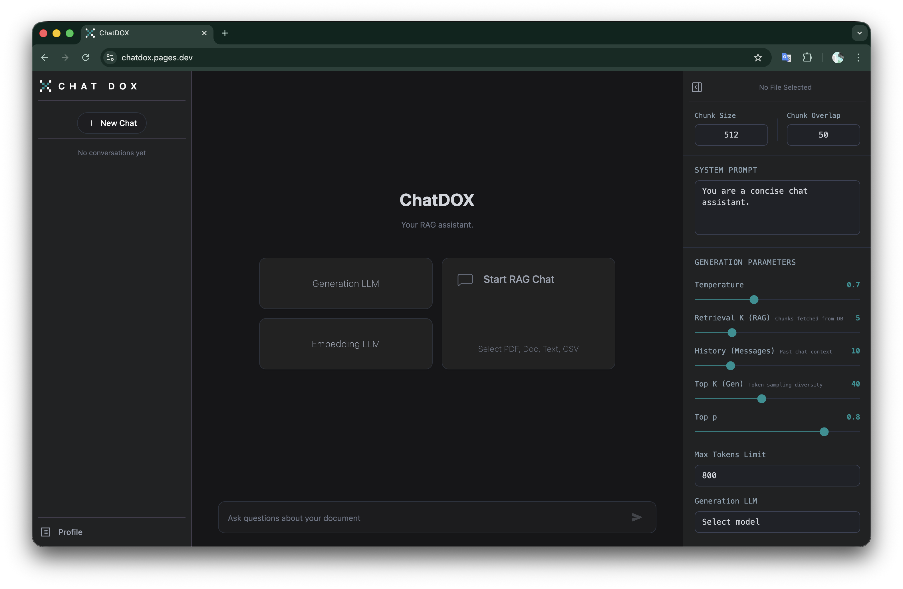
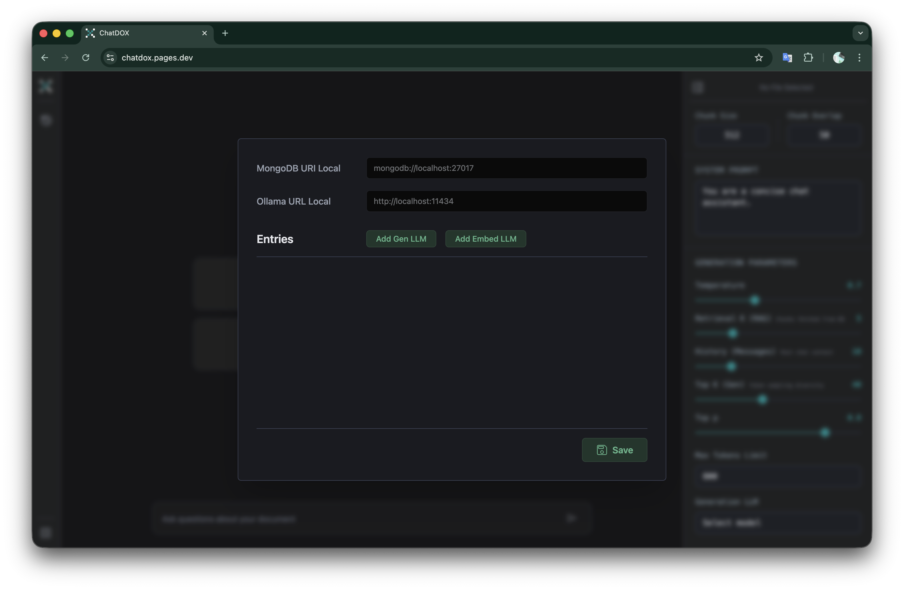

#  ChatDOX : Local RAG Engine

**Live1 Frontend:** [https://chatdox.pages.dev](https://chatdox.pages.dev) <br/>
**Live2 Frontend:** [https://chat-dox.vercel.app](https://chat-dox.vercel.app)

**ChatDOX** is a high-performance, local-first Retrieval-Augmented Generation (RAG) assistant. Built with **FastAPI** and **LangChain**, it allows users to chat with their documents (PDF, Docx, CSV, TXT) using entirely local LLMs via **Ollama**, ensuring 100% data privacy.



##  Features

* **Local RAG Pipeline**: Full document processing including parsing, recursive character chunking, and vector embedding.
* **Vector Search**: Integrated with **ChromaDB** for efficient similarity search and context retrieval.
* **Multi-Model Support**: Dynamically switch between Generation and Embedding models hosted on **Ollama**.
* **Persistent Storage**: Powered by **MongoDB** for conversation history and custom session-based settings.
* **Streaming Responses**: Real-time token streaming using FastAPI `StreamingResponse` and Server-Sent Events (SSE).
* **Configuration Management**: Built-in profile system to manage local URLs and model availability.

---

##  Tech Stack

* **Framework**: FastAPI (Python 3.10+)
* **Orchestration**: LangChain & LangChain Community
* **Vector DB**: ChromaDB
* **Database**: MongoDB (via Motor for async support)
* **Inference**: Ollama (Local)
* **Document Parsing**: PyMuPDF (PDF), Docx2txt (Word), CSVLoader

---

##  Screenshots

###  Configuration & Connectivity
Easily configure your local MongoDB and Ollama endpoints. Add or remove local models dynamically to update the frontend selection.


---

##  Quick Start

### 1. Prerequisites
* **Ollama**: Installed and running locally, by default on `http://localhost:11434`
* **MongoDB**: Local instance running on `mongodb://localhost:27017`.
* **Python**: Version 3.10 or higher.

### 2. Installation
```bash
# Clone the repository
git clone https://github.com/jakirhussain28/Chat-with-Doc.git
cd backend

# Create a virtual environment
python3 -m venv venv
source venv/bin/activate  # On Windows: venv\Scripts\activate

# Install dependencies
pip install -r requirements.txt

# Run FastAPI server (strictly on port 3000)
python3 main.py